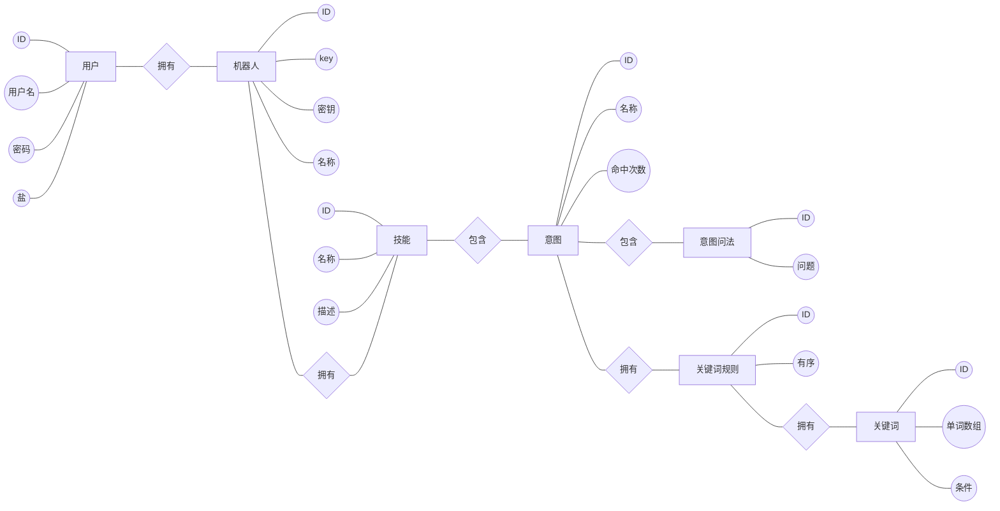

# e-r

```mermaid
graph LR
u_id((ID)) --- user[用户]
u_username((用户名)) --- user
u_password((密码)) --- user
u_salt((盐)) --- user

bot[机器人] --- b_id((ID))
bot --- b_api_key((key))
bot --- b_secret_key((密钥))
bot --- b_name((名称)) 

skill_id((ID)) --- skill[技能]
skill_name((名称)) --- skill
skill_description((描述)) --- skill

user --- user_bot{拥有}
user_bot --- bot

bot --- bot_skill{拥有}
bot_skill --- skill

intent[意图] --- intent_id((ID))
intent --- intent_name((名称))
intent --- intent_hits((命中次数))

skill --- skill_intent{包含}
skill_intent --- intent

question[意图问法] --- question_id((ID))
question --- question_content((问题))

intent --- intent_question{包含}
intent_question --- question

role_keyword[关键词规则] --- role_keyword_id((ID))
role_keyword --- role_keyword_sorted((有序))

keyword[关键词] --- keyword_id((ID))
keyword --- keyword_words((单词数组))
keyword --- keyword_condition_sign((条件))

intent --- intent_role_keyword{拥有}
intent_role_keyword --- role_keyword

role_keyword --- role_keyword_keyword{拥有}
role_keyword_keyword --- keyword


```
